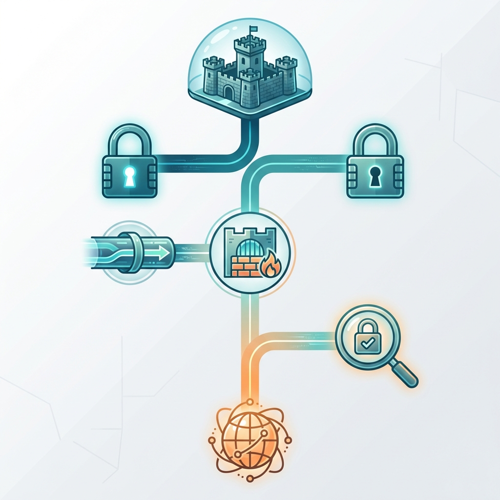
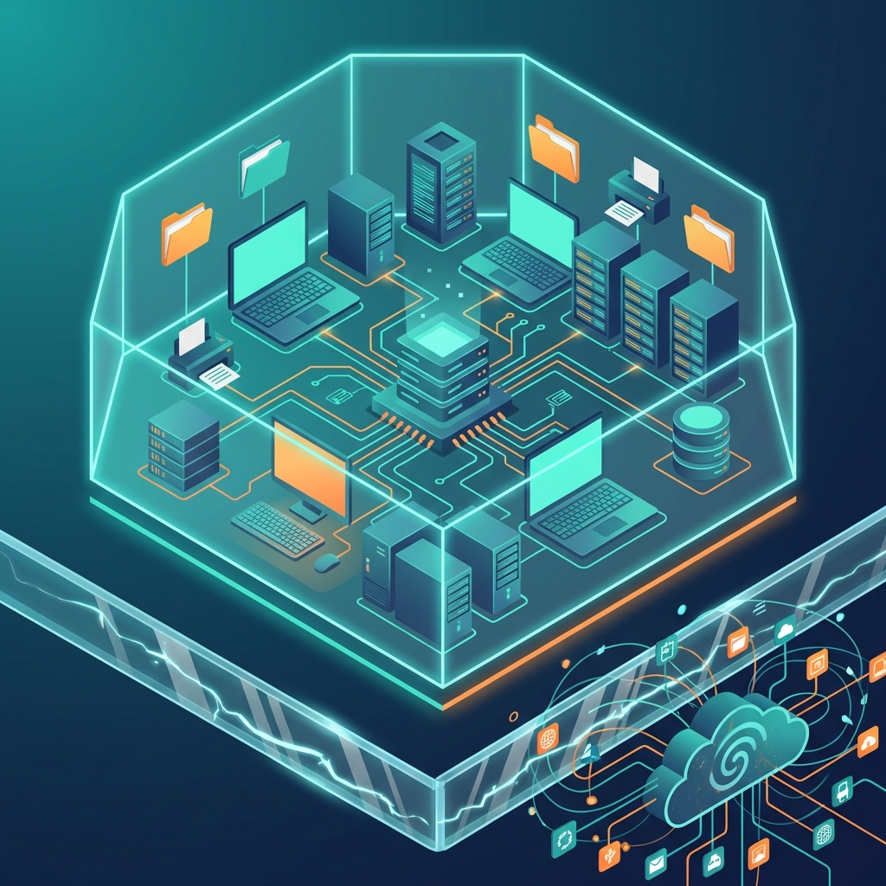
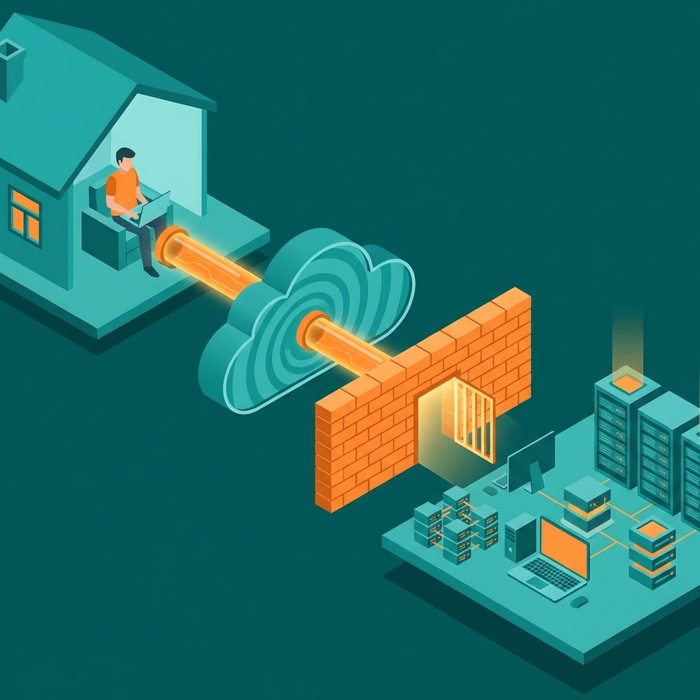

<Music track="ambient-tech" action="fade-in" />

<Speaker voice="narrator" name="Fortæller">
Forestil dig to byer. Den første er en middelalderborg med tykke mure, voldgrav og en enkelt bevogtede port. Den anden er en moderne storby med åbne veje, wifi overalt og besøgende fra hele verden. Hvilken er mest sikker? Svaret afhænger af, hvad du beskytter.
</Speaker>

<Pause duration={1.5} />

Velkommen til tredje og sidste del af vores **tillids-serie**. I dag udforsker vi **netværkstillid** — fra total isolation til det åbne internet.

<Music track="ambient-tech" action="fade-out" />

## Spektret: Fra Borg til Åben By

Netværkssikkerhed handler ikke om "sikker" versus "usikker." Det er et **spektrum** med mange niveauer.

<Speaker voice="narrator">
Hvert niveau har sine fordele og ulemper. Lad os udforske dem alle.
</Speaker>

<Pause duration={1} />

## Niveau 1: <Voice text="Air Gap">Air Gap</Voice> — Den Isolerede Borg

<Speaker voice="host" name="Vært">
Det mest sikre netværk er slet ikke forbundet til noget andet.
</Speaker>

Et **<Voice text="air-gapped">air-gapped</Voice>** system har ingen forbindelse til internettet eller andre netværk. Bogstaveligt talt er der "luft" mellem systemet og omverdenen.

### Hvor bruges det?
- **Atomkraftværker** og kritisk infrastruktur
- **Militære systemer** og efterretningstjenester
- **Finansielle handelssystemer** (visse dele)
- **Medicinske apparater** i hospitaler

### Fordele
- ✅ Næsten umuligt at hacke remotet
- ✅ Ingen malware kan "ringe hjem"
- ✅ Maksimal kontrol over data

### Ulemper
- ❌ Opdateringer kræver fysisk adgang
- ❌ Svært at samarbejde og dele data
- ❌ <Voice text="USB-enheder">USB-enheder</Voice> bliver det svage punkt

<SoundEffect name="dramatic-reveal" />

**Virkeligheden:** I 2010 viste **Stuxnet**-ormen, at selv <Voice text="air-gappede">air-gappede</Voice> systemer kunne angribes — via en inficeret <Voice text="USB">USB</Voice>-nøgle.

<Pause duration={1} />

## Niveau 2: Lukket Netværk — Borgen med én Port

Det næste niveau er et **lukket netværk** — fysisk forbundet internt, men uden direkte adgang til internettet.

### Hvor bruges det?
- Interne systemer i virksomheder
- Produktionsanlæg (<Voice text="O.T.">OT</Voice>-netværk)
- Skoler og uddannelsesinstitutioner (visse netværk)

### Fordele
- ✅ Intern samarbejde er muligt
- ✅ Ingen ekstern angrebsflade
- ✅ Enklere at kontrollere, hvem der har adgang

### Ulemper
- ❌ Begrænset funktionalitet
- ❌ Hvis én maskine kompromitteres internt, spredes angrebet nemt
- ❌ "Indenfor murene = tillid"-problemet

## Niveau 3: <Voice text="V.P.N.">VPN</Voice> + Firewall — Borgen med Vindebro

<Speaker voice="narrator">
De fleste virksomheder befinder sig her. De har en firewall, der beskytter perimeteren, og bruger <Voice text="V.P.N.">VPN</Voice> til at lade medarbejdere "tunnelere" ind.
</Speaker>

### Hvordan virker <Voice text="V.P.N.">VPN</Voice>?
1. Du starter en krypteret tunnel til virksomhedens netværk
2. Din trafik går gennem denne tunnel
3. Firewallen ser dig som "intern" bruger
4. Du får adgang til alt internt

### Problemet
<SoundEffect name="buzzer-wrong" />

Når du først er "inde" via <Voice text="V.P.N.">VPN</Voice>, stoler systemet på dig. Det er den klassiske "borg"-model:

- Hvis din bærbare er kompromitteret, har angriberen nu **fuld adgang**
- Lateral bevægelse (at hoppe fra system til system) er nem
- <Voice text="V.P.N.">VPN</Voice>-credentials bliver mål for phishing

<Pause duration={1} />

> **"<Voice text="V.P.N.">VPN</Voice> løser problemet med at komme ind. Det løser ikke problemet med, hvad der sker, når nogen først er inde."**

## Niveau 4: <Voice text="Zero Trust">Zero Trust</Voice> — Hver Dør Har Sin Vagt

<Music track="transition-build" action="start" />

<Speaker voice="host" name="Vært">
Her kommer paradigmeskiftet. <Voice text="Zero Trust">Zero Trust</Voice> kvitter borgmodellen og siger: "Stol aldrig, verificér altid."
</Speaker>

<Music track="transition-build" action="fade-out" />

### <Voice text="Zero Trust">Zero Trust</Voice>-principper

| Princip | Betydning |
|---------|-----------|
| **Verificér eksplicit** | Autentificér og autoriser baseret på alle tilgængelige datapunkter |
| **Mindste privilegium** | Giv kun adgang til det, der er nødvendigt — intet mere |
| **Antag brud** | Design som om netværket allerede er kompromitteret |

### Eksempel: Adgang til en fil

**Borg-model (<Voice text="V.P.N.">VPN</Voice>):**
1. Log ind via <Voice text="V.P.N.">VPN</Voice> ✅
2. Adgang til alle filer på serveren ✅

**<Voice text="Zero Trust">Zero Trust</Voice>:**
1. Er brugeren den, de påstår? (MFA) ✅
2. Er enheden compliant? (Opdateret, krypteret) ✅
3. Har brugeren specifik adgang til denne fil? ✅
4. Er det normalt, at brugeren tilgår denne fil kl. 3 om natten fra Rusland? ❌

<SoundEffect name="success-chime" />

### Hvem bruger <Voice text="Zero Trust">Zero Trust</Voice>?
- Google (BeyondCorp)
- Microsoft (alle interne systemer)
- Finansielle institutioner
- Sundhedsvæsenet (stigende adoption)

## Niveau 5: Åbent Internet — Den Frie By

<Speaker voice="narrator">
I den anden ende af spektret har vi det åbne internet — ingen borg, ingen mure, alle kan komme og gå.
</Speaker>

### Hvor bruges det?
- Offentlige websites
- <Voice text="A.P.I.">API</Voice>'er til tredjeparter
- <Voice text="Software as a Service">SaaS</Voice>-produkter

### Hvordan beskytter man sig?
Selvom tjenesten er "åben," kræver det stadig:
- **<Voice text="H.T.T.P.S.">HTTPS</Voice>** — Krypteret forbindelse
- **Rate limiting** — Begræns antallet af forespørgsler
- **<Voice text="WAF">WAF</Voice>** — Web Application Firewall
- **Autentifikation** — For følsomme handlinger
- **Overvågning** — Log og alarmer

## Sammenligningstabel

<View>Her er en komplet sammenligning:</View>

| Niveau | Sikkerhed | Fleksibilitet | Typisk brug |
|--------|-----------|---------------|-------------|
| 🏰 <Voice text="Air Gap">Air Gap</Voice> | ⭐⭐⭐⭐⭐ | ⭐ | Kritisk infrastruktur |
| 🔒 Lukket | ⭐⭐⭐⭐ | ⭐⭐ | Produktionsanlæg |
| 🌐 <Voice text="V.P.N.">VPN</Voice> | ⭐⭐⭐ | ⭐⭐⭐ | Traditionelle virksomheder |
| 🔍 <Voice text="Zero Trust">Zero Trust</Voice> | ⭐⭐⭐⭐ | ⭐⭐⭐⭐ | Moderne virksomheder |
| 🌍 Åbent | ⭐⭐ | ⭐⭐⭐⭐⭐ | Offentlige tjenester |

## Hvad Er Det Rigtige for Dig?

<Speaker voice="host" name="Vært">
Der er ikke ét rigtigt svar. Det afhænger af, hvad du beskytter.
</Speaker>

<Pause duration={1} />

### Spørgsmål at stille:

1. **Hvad er konsekvensen ved et brud?**
   - Nationale sikkerhed → <Voice text="Air Gap">Air Gap</Voice>
   - Forretningshemmeligheder → <Voice text="Zero Trust">Zero Trust</Voice>
   - Offentlig information → Åbent med beskyttelse

2. **Hvor fleksibelt skal systemet være?**
   - Samarbejde med eksterne → <Voice text="Zero Trust">Zero Trust</Voice> eller åbent
   - Kun interne brugere → Lukket eller <Voice text="V.P.N.">VPN</Voice>

3. **Hvad er dit budget og ressourcer?**
   - <Voice text="Zero Trust">Zero Trust</Voice> kræver investering i identitetsstyring
   - <Voice text="V.P.N.">VPN</Voice> er billigt, men har begrænsninger
   - <Voice text="Air Gap">Air Gap</Voice> kræver fysisk sikkerhed

## Den Hybride Virkelighed

<Music track="conclusion" action="fade-in" />

<Speaker voice="narrator">
I praksis bruger de fleste organisationer en **kombination** af niveauer.
</Speaker>

Eksempel på en moderne virksomhed:

- **<Voice text="Air Gap">Air Gap</Voice>**: Backup-systemer, kritiske krypteringsnøgler
- **<Voice text="Zero Trust">Zero Trust</Voice>**: Daglige forretningsapplikationer
- **Åbent**: Virksomhedens website og marketing

## Opsummering af Tillidsserien

| Emne | Nøgleindsigt |
|------|--------------|
| **Tillid (Del 1)** | Kæden er kun så stærk som det svageste led |
| **Certifikater (Del 2)** | Pas beviser identitet, <Voice text="S-BOM">SBOM</Voice> afslører indhold |
| **Netværk (Del 3)** | Vælg sikkerhedsniveau baseret på risiko og behov |

<Pause duration={1} />

---

**Bundlinje:** Der findes ikke ét "rigtigt" sikkerhedsniveau. Det handler om at matche beskyttelsen med det, du beskytter — og at huske, at <Voice text="Zero Trust">Zero Trust</Voice> ikke er et produkt, men en filosofi.

<Pause duration={1.5} />

<Emphasis type="question">**Hvor på spektret befinder din organisation sig — og er det det rigtige sted?**</Emphasis>

<Music track="conclusion" action="fade-out" />

---

*Dette var den sidste artikel i vores tillids-serie. Har du spørgsmål eller ønsker til fremtidige emner? Del dem i kommentarerne!*
