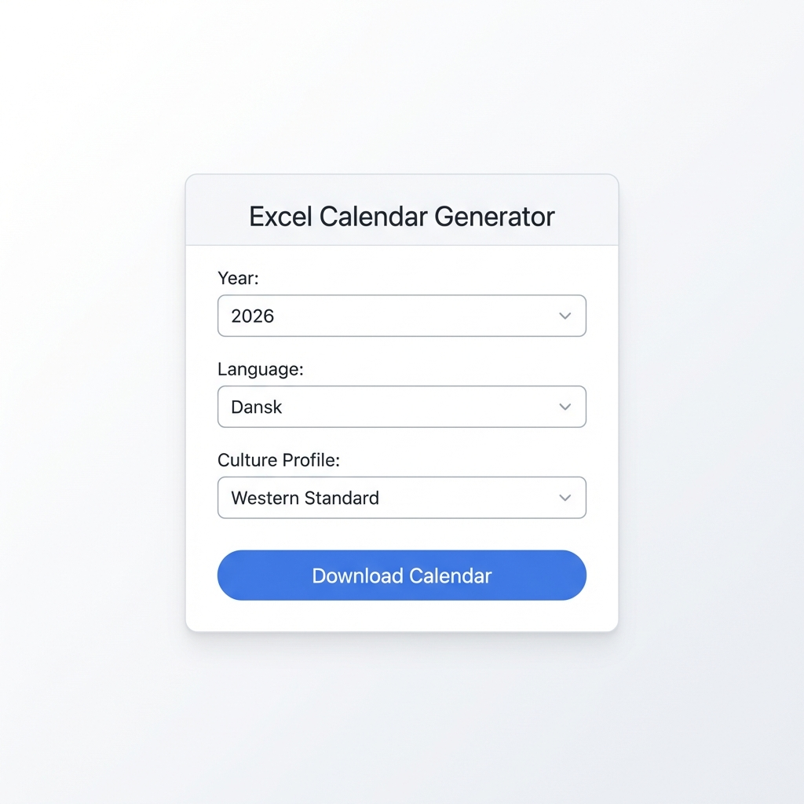
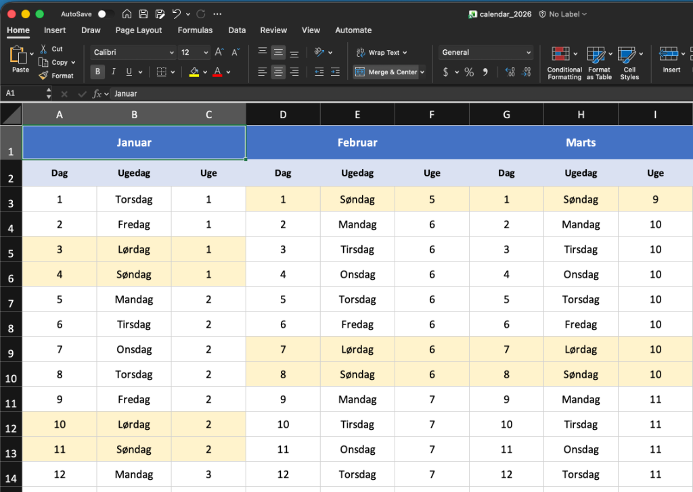

<Speak>Welcome to this practical case study. Today we show how an AI agent builds an entire application from a single Issue description.</Speak>

In the previous episodes, we learned about AI assistants, prompts, GitHub collaboration, and agentic AI. But theory is one thing — let's see it in practice.

**The Task:** Build a web application that generates colorized Excel calendars with cultural awareness.

**The Method:** One Issue description. One AI agent. Zero human keyboard.

---

## Our Issue Description

Here is the exact Issue we created in GitHub:

<View>See the full Issue description below:</View>

```markdown
# Excel Calendar Generator

Build a Vite-based web application that generates a colorized 
Excel file with 12 columns (one per month) on a single sheet.

## Functional Requirements

### Calendar Structure
- **12 columns** — one column per month
- **Columns** — Day number, Weekday, Week number
- **Colors** — Weekend days marked with background color

### Cultural Settings
- **Start of week** — Choose between Monday or Sunday
- **Weekend days** — Choose which days are weekend
  - Standard (Saturday/Sunday)
  - Arabic culture (Thursday/Friday)
  - Custom (choose your own)

### Languages
- Danish
- English
- Arabic
- Greenlandic (if possible)

### Year
- Select which year the calendar is generated for

## Technical Requirements
- Vite + React
- ExcelJS for Excel generation
- GitHub Actions for GitHub Pages deployment
- CNAME: excel-calendar.app.happymates.dk

## Repository
https://github.com/happy-mates/excel-calendar-mate
```

That's it. 47 lines. No code. No wireframes. Just requirements.

---

## What the AI Agent Did

<Speaker voice="narrator">The agent received the Issue and got to work. Here's what it produced — completely autonomously.</Speaker>

### 1. Project Setup

The agent initialized a new Vite project with TypeScript and React:

```bash
npm create vite@latest ./ -- --template react-ts
npm install exceljs file-saver
npm install -D @types/file-saver
```

### 2. Language Support

The agent created translation files for all four languages:

| Language | File | Months | Weekdays |
|----------|------|--------|----------|
| Danish | `da.json` | Januar, Februar... | Mandag, Tirsdag... |
| English | `en.json` | January, February... | Monday, Tuesday... |
| Arabic | `ar.json` | يناير, فبراير... | الاثنين, الثلاثاء... |
| Greenlandic | `kl.json` | Januaarip, Februaarip... | Ataasinngorneq... |

<Pause duration={1} />

Yes, the agent actually found Greenlandic translations.

### 3. Cultural Weekend Settings

The agent implemented three predefined culture profiles:

| Culture | Weekend Days | Start of Week |
|---------|--------------|---------------|
| Western standard | Saturday, Sunday | Monday |
| Arabic culture | Thursday, Friday | Sunday |
| Custom | User-selected | User-selected |

### 4. Excel Generation with Colors

The agent used ExcelJS to create colorized sheets:

```typescript
// Weekend days get special background color
if (isWeekend(date, weekendDays)) {
  row.getCell(1).fill = {
    type: 'pattern',
    pattern: 'solid',
    fgColor: { argb: 'FFE6E6FA' } // Light lavender
  };
}
```

### 5. GitHub Actions Deployment

The agent created a complete CI/CD pipeline:

```yaml
name: Deploy to GitHub Pages

on:
  push:
    branches: [main]

jobs:
  build-and-deploy:
    runs-on: ubuntu-latest
    steps:
      - uses: actions/checkout@v4
      - uses: actions/setup-node@v4
      - run: npm ci
      - run: npm run build
      - uses: peaceiris/actions-gh-pages@v4
        with:
          github_token: ${{ secrets.GITHUB_TOKEN }}
          publish_dir: ./dist
          cname: excel-calendar.app.happymates.dk
```

---

## The Final Result

<View>Here are screenshots of the final application:</View>

### The User Interface

The application has a clean, simple interface:

- **Year selector** — dropdown or numeric input
- **Language selector** — Danish, English, Arabic, Greenlandic
- **Culture profile** — Western, Arabic, or Custom
- **Download button** — generates and downloads the Excel file

<Pause duration={1} />



### The Generated Excel File

The Excel file contains:

- **12 sheets** — one for each month
- **Colorized weekends** — clearly marked
- **Week numbers** — ISO standard
- **Localized names** — in the selected language

<Pause duration={1} />



---

## What We Learned

### Strengths of Agentic AI

| Observation | Significance |
|-------------|--------------|
| **Complete project setup** | The agent handled everything from `npm create` to deployment |
| **Correct library choices** | ExcelJS was the right choice for Excel generation |
| **Cultural awareness** | The agent understood Arabic weekend conventions |
| **Greenlandic translation** | The agent found obscure but correct translations |

### Where Humans Are Still Important

| Area | Why |
|------|-----|
| **Requirement specification** | We defined the cultural sensitivity |
| **Verification** | We checked that Greenlandic was correct |
| **Design decisions** | Color choices and UI layout required approval |
| **Edge cases** | Leap years, months with 28/29/30/31 days |

---

## Your Turn: Try It Yourself

<Speaker voice="narrator">You can use this approach on your own projects. Here's the recipe.</Speaker>

### Step 1: Write a Good Issue

Include:
- **Functional requirements** — what should the application do?
- **Technical requirements** — which technologies?
- **Constraints** — what should it *not* do?
- **Success criteria** — how do we know it works?

### Step 2: Provide Context

Link to:
- Similar projects
- Design inspiration
- Documentation for chosen technologies

### Step 3: Assign to AI

In GitHub:
1. Create Issue with your description
2. Assign to `@copilot` or your chosen agent
3. Wait for Pull Request

### Step 4: Review and Iterate

When the PR arrives:
1. Read the code thoroughly
2. Test the functionality
3. Provide feedback via comments
4. Approve or request changes

---

## Live Demo

Try the application directly here:

<div style={{position: 'relative', width: '100%', marginBottom: '2rem'}}>
  <a href="https://excel-calendar.app.happymates.dk" target="_blank" rel="noopener noreferrer" style={{position: 'absolute', top: '8px', right: '8px', zIndex: 10, display: 'inline-flex', alignItems: 'center', gap: '0.5rem', padding: '0.5rem 0.75rem', backgroundColor: 'rgba(59, 130, 246, 0.9)', color: 'white', borderRadius: '6px', textDecoration: 'none', fontSize: '0.75rem', boxShadow: '0 2px 4px rgba(0,0,0,0.1)'}}>
    🔗 Open in new tab
  </a>
  <iframe 
    src="https://excel-calendar.app.happymates.dk" 
    style={{width: '100%', height: '500px', border: '1px solid #e5e7eb', borderRadius: '8px'}}
    title="Excel Calendar Generator"
  />
</div>

The source code is available at:

**<a href="https://github.com/happy-mates/excel-calendar-mate" target="_blank" rel="noopener noreferrer">github.com/happy-mates/excel-calendar-mate</a>**

---

## Summary

| Element | Detail |
|---------|--------|
| **Input** | 47-line Issue description |
| **Output** | Complete Vite app with Excel generation |
| **Time** | Under 1 hour from Issue to deployment |
| **Human work** | Requirement specification + review |
| **AI work** | Everything else |

---

**Bottom line:** A well-written Issue description is your superpower. The clearer you formulate your requirements, the better the AI agent can deliver.

---

*What would you build if you could describe it in an Issue and have it delivered the next day? Share your ideas with us.*
